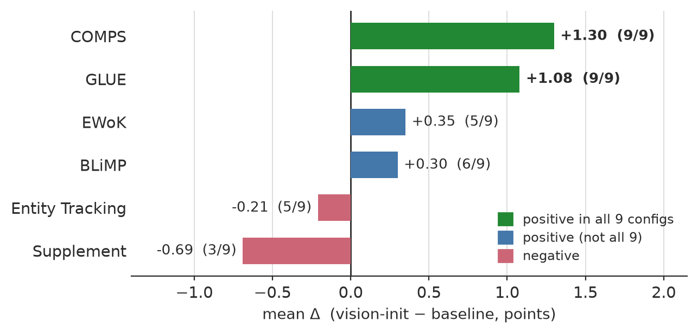
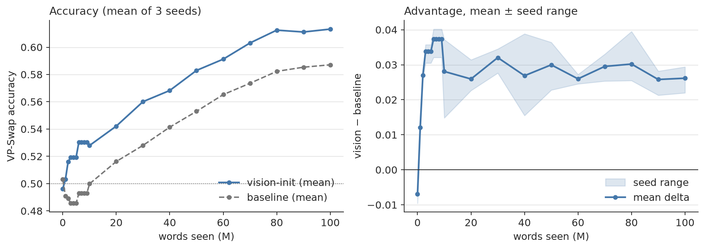
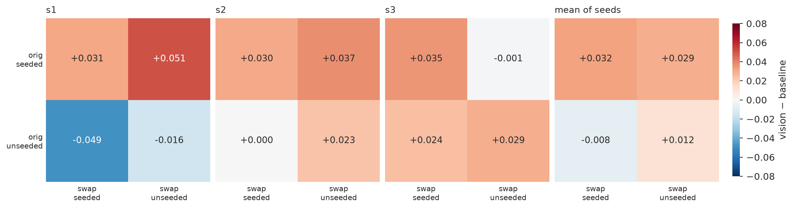
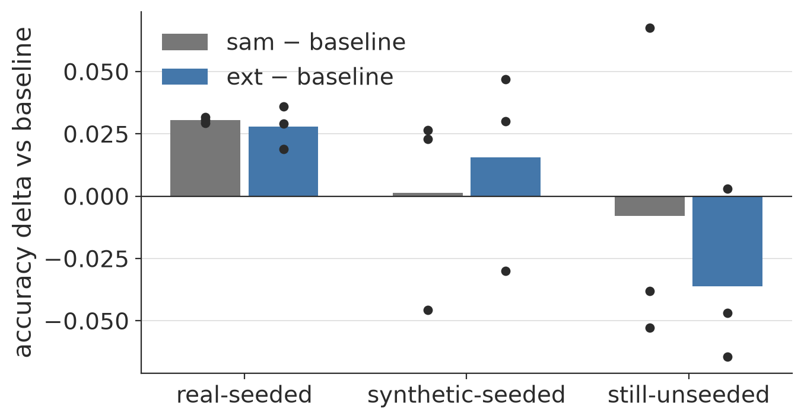
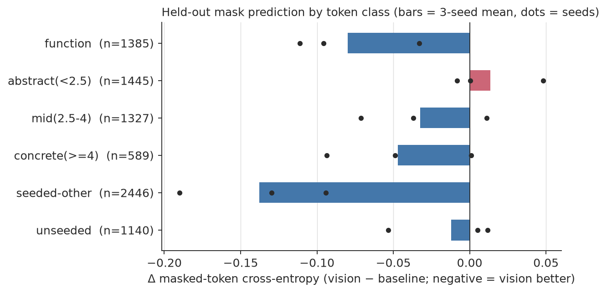

# Augustinian BabyLM: What Ostensive Definition Can and Cannot Teach a Small Language Model

A language model normally begins training with random word embeddings: whatever 'banana' means must be learned from training corpora. I implement St. Augustine's picture of word learning---meaning by ostension---for a small masked language model (DeBERTa) trained on 10M words: before training, visually grounded tokens receive embeddings derived from the image regions they label; all other tokens start random. 

Visual grounding leaves a clear, measurable, and lasting mark.  However, the effect is hard to see behaviorally through the standard BabyLM evaluation---the aspects of word meaning that visual grounding informs are mostly outside of the benchmark scope. I construct a behavioral probe on which the effect should show: a  corpus-tailored version of the Visual-Property Swap benchmark that tests color, material, size, and shape knowledge and whose items carry each word's training frequency and seeded status. Vision-seeded models prove to have a persistent, seed-replicated advantage that is specific to seeded words. 

Finally, I show that even the classic abstract, logical words receive strong visual seeds, retain them, and they help the training objective---yet there are no benchmarks to register the effect. This benchmark blindness might be the main lesson from my Augustinian set-up.

Setup: DeBERTa-v3-base models trained on `bb24.train` — the ~9.9M-word custom corpus of our BabyLM 2024 submission ([Edman et al. 2024](https://aclanthology.org/2024.conll-babylm.14/)): LLM-synthesized paraphrase/contrastive data (SynCSE-partial) mixed with portions of the official BabyLM corpus — within the 10M-word budget, 10
epochs, comparing random-init baselines against vision-initialized variants
— across three BPE vocabulary sizes (50k / 75k / 100k) and three vision
encoders (DINOv3, SAM, iBOT), i.e. 3 baselines + 9 vision-init models.
Depending on vocabulary size, only ~24–38% of word *types* receive a visual
seed (the rest of the vocabulary has no image support); seeded words skew
strongly toward concrete nouns.

## How to read the results

Almost everything below is measured with **minimal pairs**: the model sees
two sentences differing in exactly one word — one true ("The banana is
yellow"), one false ("The television is yellow") — and is scored correct if
it assigns the true sentence higher probability (for masked LMs, computed
as pseudo-log-likelihood: mask each token in turn, sum the log-probability
of the original token). Chance is 50%. No fine-tuning, no generation.

A **delta** is always *vision-init minus baseline* accuracy, in points.
Since we have only one training run per configuration (no seed variance
estimate), single deltas of a point or two are not individually meaningful;
what we lean on instead is **sign-consistency**: if a task's delta is
positive in all 9 encoder×vocabulary combinations independently, that
pattern is very unlikely under a no-effect null even when each delta is
small.

For the targeted benchmark we additionally use:
- **Difference-in-differences (DiD)**: the advantage on *seeded* words
  minus the advantage on *unseeded* words, computed **within the same
  corpus-frequency bin**. This isolates the word-specific effect of the
  intervention from confounds — if vision-init helped via some global
  mechanism (better optimization, luckier init), it would help seeded and
  unseeded words equally, and the DiD would be zero.
- **A placebo cell**: items where *neither* the original word *nor* the
  swapped-in word ever received a visual seed. On these items the two
  models are, with respect to the intervention, identical — so their delta
  should be zero. If it is, any effect elsewhere is attributable to the
  seeding.
- **McNemar's test**: a paired significance test that only counts items
  where the two models *disagree* (one correct, the other not) — the
  appropriate test when both models answer the same items.

## Key results

**Visual initialization helps exactly where visual information should
matter — and nowhere else.**

### 1. Official BabyLM 2026 evaluation

Across all 9 encoder × vocabulary combinations, the only consistently
positive zero-shot task is **COMPS** — a benchmark testing knowledge of
object properties ("a sparrow has wings") and its inheritance to novel
concepts (+1.3 mean, positive 9/9; GLUE fine-tuning also +1.1 at 9/9).
Within COMPS the gain sits in the property-knowledge conditions (`base`
+1.4, `wugs` +3.7, both 9/9) and vanishes when distractor sentences are
inserted. The COMPS gain additionally replicates across the 3 seed runs
of the headline pair (+1.46 / +1.05 / +0.77), while every other zero-shot
task flips sign between seeds — pure noise by contrast. Syntax (BLiMP) is flat; BLiMP-supplement slightly negative.
That is: the general-purpose evaluation shows a gain precisely on its one
object-property task, and nowhere else.

### 2. VP-Swap: a targeted visual-property probe

If vision-init injects visual knowledge, the cleanest place to look for it
is a benchmark that *asks about visual properties*. No such benchmark
exists for our corpus, so we built one ([`eval/vpswap_bb24/`](eval/vpswap_bb24/)),
following EgoBabyVLM's VP-Swap protocol: 7,416 minimal-pair items over
four properties (color, material, size, shape), constructed from our own
training corpus so that every item carries the noun's **corpus frequency**
(how often the model saw it in training) and its **seeded status**
(whether it received a visual embedding). Sentences rotate over four
syntactic frames (e.g. "A femur is white" vs "She picked up the white
femur") so the effect can be checked for robustness to sentence form.

Comparing the best vision-init model (75k-SAM) to its same-vocabulary
baseline over the whole training trajectory:

- **Persistent advantage.** Vision-init leads at every checkpoint from 1M
  words on, peaking mid-training (+3.5 pts) and retaining +1.9 at 100M
  — **replicated across 3 random seeds**
  (final delta +1.9 / +2.7 / +3.0; McNemar z = 3.75 / 5.29 / 5.90).
  Untrained checkpoints score 0.49–0.51 in every seed — the probe itself
  is unbiased.

- **Word-specific, tied to the seeding.** The advantage on items whose
  original noun received a visual seed is strikingly stable across seeds
  (+0.029 / +0.030 / +0.032) and holds at matched corpus frequency
  (positive DiD in every measurable bin). The apparent *penalty* on
  unseeded words in our first run did **not** replicate (−0.048 / +0.008 /
  +0.036 across seeds — consistent with zero): what is stable is the
  seeded-word gain, not an unseeded-word cost. The seed-averaged 2×2 below
  splits items by whether the original and the swapped-in noun were
  seeded.

- The effect appears in 3 of 4 syntactic frames (the short copular frame
  reverses; noted, unexplained) and concentrates in mid/high-frequency
  words — at this corpus size, low-frequency items are at chance for both
  models, leaving no room for a difference.

### 3. Extending coverage with synthetic grounding

If the effect is caused by visual grounding, adding grounding to
previously ungrounded words should extend it. We tested this directly:
for 1,986 concrete zero-support words we generated short scene
descriptions (LLM), rendered 3 images each (SDXL-Turbo), localized the
target words with open-vocabulary detection (OWLv2; undetectable words
drop out), and pooled SAM features in the detected boxes through the
original extraction code — yielding 1,151 newly grounded words (+737
seeded tokens, 21,134 → 21,871) and a `75k-sam-ext` model trained with
3 seeds. Result: on the synthetically grounded words, ext beats sam in
**3/3 seeds** (+1.6 / +2.0 / +0.7 pts; sam itself sits at +0.1 vs
baseline there), the advantage is present at every checkpoint from 10M
words on, the real-seeded group is untouched (ext − sam = −0.003), and
COMPS stays positive in all ext seeds. Synthetic grounding buys roughly
half the per-word effect of real grounding — a modest but replicated
extension of the mechanism to words no photograph dataset covers.

### Why the advantage persists (and why its late decay is benign)

We asked whether the shrinking late-training advantage could be preserved
by continually mixing the visual embeddings back in during training. The
embedding dynamics say no — and explain the effect's persistence instead
(`eval/drift_diagnostic.py`). Seeded embeddings abandon their visual
anchors almost entirely (mean cosine to init: 1.00 at 1M words → 0.15 at
100M), and per-word drift is uncorrelated with per-word advantage change
(r = −0.02): the advantage does not reside in proximity to the visual
features, so an anchoring intervention has no target. What *does* survive
is relational: the pairwise-similarity structure among seeded words
retains RSA = 0.31 to the visual anchor at 100M — three times the 0.10
floor set by the text-only baseline — and this residue is stable over the
second half of training while absolute positions keep moving. The
"decay" itself is benign: the vision model's absolute accuracy never
declines; the baseline catches up on the learnable part. Visual
initialization thus acts as an integrated bias on what gets learned — a
scaffold that is largely dismantled after use, leaving a durable
relational imprint — not as a store of preserved visual features.

### Does grounding abstract words help?

Our grounding data inevitably also seeds abstract and function words
("not", "every", "three", "the" appear in nearly every caption). Their
seeds turn out to be real signal, not washed-out averages, and the model
retains their visual-anchor structure to the end of training (RSA 0.45
vs a ≈0 baseline floor) — yet phenomena hinging on such words show no
benefit (BLiMP: abstract-varying phenomena −0.8 vs concrete-varying
+0.8, 3 seeds). Visual grounding helps only where a word's meaning is
the kind of thing vision can inform; the bottleneck is meaning type, not
seed quality or retention. One flagged exception: EWoK `number` (+5.8)
— numerals are seeded, and quantity is visually manifest. Strikingly, the training objective itself *does* use this
information — vision-init predicts held-out masked function words better
in 3/3 seeds — the gap is in the benchmarks, not the model:

Details, figures, tables, word lists:
[`docs/grounding_scope.md`](docs/grounding_scope.md).

Full tables: [`eval/official_results.md`](eval/official_results.md),
[`eval/vpswap_results.md`](eval/vpswap_results.md),
[`eval/seed_results.md`](eval/seed_results.md).

### Why aggregate scores miss this

Our coverage analysis ([`analysis/`](analysis/)) shows why the effect is
invisible in headline numbers: the seedable fraction of word types falls
37.7% → 29.1% → 23.8% across vocabulary sizes and skews strongly concrete
(r = 0.46 with concreteness norms). Benchmarks dominated by syntax and
function words simply never query the part of the vocabulary the
intervention touches.

### Limitations

One training run per configuration, except the headline pair (75k-SAM vs
75k) and the synthetic-extension model, each replicated with 3 random
seeds; the synthetic-grounding chain (LLM scenes → SDXL images → OWLv2
boxes) compounds generator priors and detection noise; VP-Swap is
LLM-generated (generator: claude-sonnet-4-6; judge: claude-haiku-4-5) and
inherits the generator's notion of typical properties; the copular-frame
reversal is unexplained; entity-tracking scores under MLM pseudo-likelihood
are artifact-prone and excluded from interpretation (diagnosis:
[`docs/entity_tracking_artifact.md`](docs/entity_tracking_artifact.md)).

## Repository map

| path | contents |
|--|--|
| `scripts/` | training + construction: region embeddings, token tables, vision-init training, VP-Swap builder, submission-branch minting |
| `slurm/` | SLURM templates for every pipeline stage |
| `analysis/` | text-vs-image coverage study (code, outputs, README) |
| `eval/` | evaluation runbooks, scorers, analysis scripts, results, plots |
| `docs/` | methodological notes |

## Reproduction pipeline

Environment: Snellius (SLURM, A100) or any CUDA machine; HF org
`augustinian-babylm` hosts tokenizers, grounding embeddings, and all model
checkpoints (stepN + chck_*M revisions). Steps, in order:

1. **Region embeddings** from grounding datasets, per encoder:
   `scripts/extract_region_embeddings.py` / `slurm/extract_region_embeddings.slurm`
   → HF `augustinian-babylm/region-embeddings`
2. **Token embedding tables** per (vocab, encoder):
   `scripts/build_token_embeddings.py` / `slurm/build_tables.slurm`
   → HF `augustinian-babylm/token-embeddings` (E_init + seeded mask)
3. **Training** (babylm25 Table-3 recipe, 10 epochs):
   baselines `slurm/train.slurm`; vision-init `slurm/train_visioninit.slurm`;
   batch driver `run_75k_100k.sh` → HF `deberta-base-{vocab}[-{encoder}]`
4. **Coverage analysis**: `analysis/` (see its README)
5. **Official evaluation + leaderboard comparison**: `eval/README.md` §A
6. **VP-Swap construction + evaluation**: `eval/README.md` §B
7. **Analysis + figures**: `eval/analyze_official.py`, `eval/analyze_vpswap.py`

## Models

12 pretrained models on HF (`augustinian-babylm/deberta-base-<vocab>` and
`...-<encoder>`), each with 37 stepN training checkpoints and 19 `chck_*M`
word-count revisions (BabyLM submission convention; `main` = final).

## License

Code is released under the MIT License. The VP-Swap benchmark in
`eval/vpswap_bb24/` is released under CC BY 4.0, and follows the
Visual-Property Swap protocol of EgoBabyVLM (Lin et al. 2026), which is
released under CC BY-NC 4.0. Models and embedding tables on the Hugging
Face Hub are released under CC BY 4.0.
