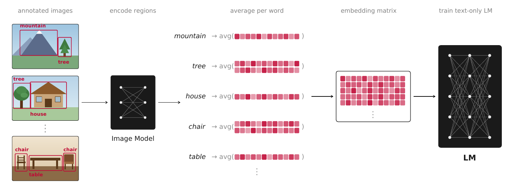
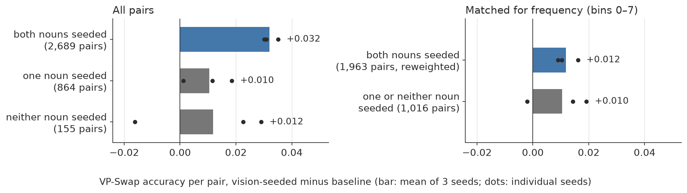
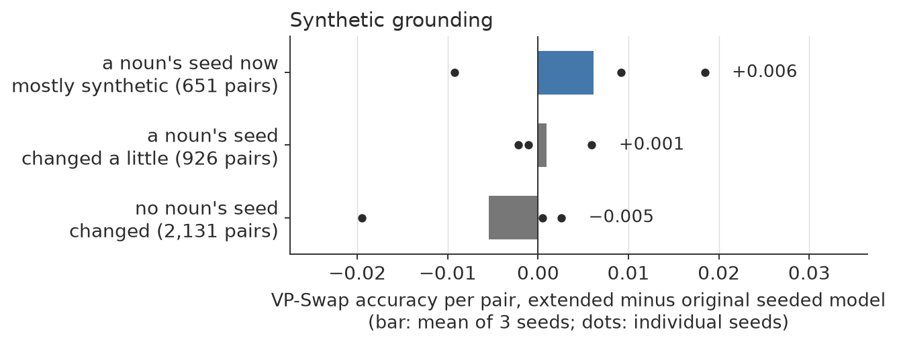

# Augustinian BabyLM

**What Ostensive Definition Can and Cannot Teach a Small Language Model**

To appear at the BabyLM Workshop 2026 · [paper](https://arxiv.org/abs/2609.11870) · [models & data on 🤗](https://huggingface.co/augustinian-babylm)

> **Note on the paper (arXiv v1).** A pair-level re-analysis of VP-Swap, below,
> revises Sections 5.2 and 6: the VP-Swap advantage replicates, but it cannot be
> attributed to the individual seeded words, and synthetic grounding shows no
> reliable effect. An updated version of the paper is in preparation.



A language model normally begins training with random word embeddings:
whatever *banana* means must be learned from training corpora. This repository
implements St. Augustine's picture of word learning, meaning by ostension, for
a small masked language model (DeBERTa) trained on ~10M words: before training,
visually grounded tokens receive embeddings derived from the image regions they
label; other tokens start random.

Visual initialization leaves a measurable imprint that lasts until the end of
training. At the same time, the effect remains invisible under most BabyLM
benchmarks, which probe abstract grammatical knowledge: visual initialization
does not affect performance there. The only zero-shot exception is
object-property knowledge (COMPS), where seeding helps in every configuration.
Following that lead, I put together a corpus-tailored version of
the Visual-Property Swap benchmark, where vision-seeded models hold a
persistent, seed-replicated advantage. The advantage is largest for frequent
nouns, and nearly all frequent concrete nouns are seeded, so the benchmark
cannot tell which words carry it; synthetically grounding more words produces
no reliable change.

Function words and abstract vocabulary also receive strong visual seeds and
retain them throughout training, and the training objective draws on them:
held-out mask-prediction loss falls for these words in every seed. No benchmark registers that. What evaluation would pick it up remains an open question.

**Setup**: DeBERTa-v3-base models trained on `bb24.train` — the ~9.9M-word custom
corpus of [Edman et al. 2024](https://aclanthology.org/2024.conll-babylm.14/):
LLM-synthesized paraphrase/contrastive data (SynCSE-partial) mixed with
portions of the official BabyLM corpus — within the 10M-word budget, 10 epochs,
comparing random-init baselines against vision-initialized variants across
three BPE vocabulary sizes (50k / 75k / 100k) and three vision encoders
(DINOv3, SAM, iBOT), i.e. 3 baselines + 9 vision-init models. Depending on
vocabulary size, only ~24–38% of word *types* receive a visual seed (the rest
of the vocabulary has no image support); seeded words skew strongly toward
concrete nouns.

## How to read the results

Almost everything below is measured with **minimal pairs**: the model sees two
sentences differing in exactly one word -- one true/expected/typical ("A cucumber is green"),
one false/unexpected/non-typical ("A dune is green") -- and is scored correct if it assigns
the true sentence higher probability (for masked LMs, computed as
pseudo-log-likelihood). Chance is 50%. No fine-tuning.

A **delta** is always *vision-init minus baseline* accuracy, in points. Since
there is only one training run per configuration (no seed variance estimate),
single deltas of a point or two are not individually meaningful; what I lean on
instead is **sign-consistency**: if a task's delta is positive in all 9
encoder-vocabulary combinations independently, that pattern is very unlikely
under a no-effect null even when each delta is small.

For the targeted benchmark I additionally use:
- **Pair-level scoring**: every VP-Swap line yields two mirror items (each noun
  is correct in its own sentence and wrong when swapped into the other's). A
  model's general preference for one noun over the other cancels only when both
  items are counted together, so all VP-Swap breakdowns below are per pair.
- **Frequency matching**: seeded nouns are mostly frequent and unseeded nouns
  mostly rare, so seeded and unseeded pairs are compared within the same
  corpus-frequency bins.
- **McNemar's test**: a paired significance test that only counts items where
  the two models *disagree* (one correct, the other not) — the appropriate test
  when both models answer the same items.

## Key results

**Visual initialization helps on the zero-shot tasks that ask what objects are
like.**

### 1. Official BabyLM 2026 evaluation

Across all 9 encoder × vocabulary combinations, the only consistently positive
zero-shot task is **COMPS** — a benchmark testing knowledge of object
properties ("a sparrow has wings") and its inheritance to novel concepts (+1.3
mean, positive 9/9; GLUE fine-tuning also +1.1 at 9/9). Within COMPS the gain
sits in the property-knowledge conditions (`base` +1.4, `wugs` +3.7, both 9/9)
and vanishes when distractor sentences are inserted. The COMPS gain
additionally replicates across the 3 seed runs of the headline pair (+1.46 /
+1.05 / +0.77), while every other zero-shot task flips sign between seeds. Syntax (BLiMP) is flat; BLiMP-supplement slightly
negative. That is: the general-purpose evaluation shows a gain precisely on its
one object-property task, and nowhere else.


### 2. VP-Swap: a targeted visual-property probe

If vision-init injects visual knowledge, the obvious place to look for it is a
benchmark that *asks about visual properties*. No such benchmark exists for
this corpus, so I built one ([`eval/vpswap_bb24/`](eval/vpswap_bb24/)),
following EgoBabyVLM's VP-Swap protocol: 7,416 minimal-pair items over four
properties (color, material, size, shape), constructed from my training
corpus so that every item carries the noun's **corpus frequency** (how often
the model saw it in training) and its **seeded status** (whether it received a
visual embedding). Sentences rotate over four syntactic frames (e.g. "A femur
is white" vs "She picked up the white femur") so the effect can be checked for
robustness to sentence form.

Comparing the best vision-init model (75k-SAM) to its same-vocabulary baseline
over the whole training trajectory:

- **Persistent advantage.** Vision-init leads at every checkpoint from 1M words
  on, peaking around 10M words (+3.7 pts) and retaining +2.2 at 100M — **replicated
  across 3 random seeds** (final delta +2.2 / +2.7 / +2.9; McNemar z = 4.37 /
  5.44 / 5.79). Untrained checkpoints score 0.49–0.51 in every seed — the probe
  itself is unbiased.


- **Which words carry it: not answerable with this benchmark.** Counted per
  pair, pairs of two seeded nouns gain +0.031 / +0.030 / +0.035, pairs with one
  or no seeded noun about +0.01. But seeded nouns are also the frequent ones:
  within the same frequency bins the two groups gain the same (+0.016 / +0.010 /
  +0.009 vs −0.002 / +0.019 / +0.014; the difference is within noise in every
  seed), and the most frequent bins contain almost no unseeded nouns. Counting
  items instead of pairs is misleading here: in one seed the vision model simply
  prefers seeded nouns, right or wrong (+0.051 when the seeded noun is the
  correct one, −0.049 when it is the swapped-in one), which cancels within each
  pair. Details: [`eval/vpswap_pairlevel.md`](eval/vpswap_pairlevel.md).



- The effect holds across all four syntactic frames (attributive +0.023,
  existential +0.031, relative +0.027, copular ≈ 0) and concentrates in
  mid/high-frequency words —
  at this corpus size, low-frequency items are at chance for both models,
  leaving no room for a difference.

### 3. Extending coverage with synthetic grounding

If the effect is caused by visual grounding, adding grounding to previously
ungrounded words should extend it. I tested this directly: for 1,986 concrete
zero-support words I generated short scene descriptions (LLM), rendered 3
images each (SDXL-Turbo), localized the target words with open-vocabulary
detection (OWLv2; undetectable words drop out), and pooled SAM features in the
detected boxes through the original extraction code — yielding 1,155 newly
grounded words (+737 seeded tokens, 21,134 → 21,871) and a `75k-sam-ext` model
trained with 3 seeds. Result: no reliable effect. Counted per pair, with a noun
treated when the seed of its own token(s) now comes mostly (≥50%) from synthetic
regions, ext − sam is +0.018 / −0.009 / +0.009 on pairs with a treated noun,
against +0.000 / +0.003 / −0.019 on pairs where no noun's seed changed. COMPS
stays positive in all ext seeds. (Splitting items by the original noun's
word-level status, as in arXiv v1, showed a 3/3-seed gain; it does not survive
pair-level counting, and word-level status is a poor proxy for which token
seeds changed, since many unseeded nouns share subword tokens that were
already seeded.)



### Why the advantage persists (and why its late decay is benign)

I asked whether the shrinking late-training advantage could be preserved by
continually mixing the visual embeddings back in during training. The embedding
dynamics suggest a negative answer — and explain the effect's persistence 
(`eval/drift_diagnostic.py`). Seeded embeddings abandon their visual anchors
almost entirely (mean cosine to init: 1.00 at 1M words → 0.15 at 100M), and
per-word drift is uncorrelated with per-word advantage change (r = −0.017): the
advantage does not reside in proximity to the visual features, so an anchoring
intervention has no target. What *does* survive is relational: the
pairwise-similarity structure among seeded words retains RSA = 0.31 to the
visual anchor at 100M (RSA 0.31) — three times the 0.10 floor set by the text-only
baseline — and this residue is stable over the second half of training while
absolute positions keep moving. The "decay" itself is benign: the vision
model's absolute accuracy never declines; the baseline catches up on the
learnable part. Visual initialization thus acts as an integrated bias on what
gets learned — a scaffold that is largely dismantled after use, leaving a
durable relational imprint — not as a store of preserved visual features.

### Does grounding abstract words help?

The grounding data inevitably also seeds abstract and function words ("not",
"every", "three", "the" appear in nearly every caption). Their seeds turn out
to be real signal, not washed-out averages, and the model retains their
visual-anchor structure to the end of training (RSA 0.45 vs a ≈0 baseline
floor) — yet phenomena hinging on such words show no benefit (BLiMP:
abstract-varying phenomena −0.8 vs concrete-varying +0.8, 3 seeds). Visual
grounding helps only where a word's meaning is the kind of thing vision can
inform; the bottleneck is meaning type, not seed quality or retention. One
flagged exception: EWoK `number` (+5.8) — numerals are seeded, and quantity is
visually manifest. Strikingly, the training objective itself *does* use this
information — vision-init predicts held-out masked function words better in 3/3
seeds — the gap is in the benchmarks, not the model:


Details, figures, tables, word lists:
[`docs/grounding_scope.md`](docs/grounding_scope.md).

Full tables: [`eval/official_results.md`](eval/official_results.md),
[`eval/vpswap_results.md`](eval/vpswap_results.md),
[`eval/seed_results.md`](eval/seed_results.md),
[`eval/vpswap_pairlevel.md`](eval/vpswap_pairlevel.md) (pair-level re-analysis;
supersedes the seeded/unseeded splits in the other VP-Swap tables).

### Why aggregate scores miss this

The coverage analysis ([`analysis/`](analysis/)) shows why the effect is
invisible in headline numbers: the seedable fraction of word types falls 37.7%
→ 29.1% → 23.8% across vocabulary sizes and skews strongly concrete (r = 0.46
with concreteness norms). Benchmarks dominated by syntax and function words
simply never query the part of the vocabulary the intervention touches.

### Limitations

One training run per configuration, except the headline pair (75k-SAM vs 75k)
and the synthetic-extension model, each replicated with 3 random seeds; the
synthetic-grounding chain (LLM scenes → SDXL images → OWLv2 boxes) compounds
generator priors and detection noise; VP-Swap is LLM-generated (generator:
claude-sonnet-4-6; judge: claude-haiku-4-5) and inherits the generator's notion
of typical properties; VP-Swap's seeded status is word-level while seeding is
token-level, and seeded nouns are mostly the frequent ones, so the benchmark
cannot attribute its effect to individual seeded words;
entity-tracking scores under MLM pseudo-likelihood are artifact-prone and
excluded from interpretation (diagnosis:
[`docs/entity_tracking_artifact.md`](docs/entity_tracking_artifact.md)).

## Repository map

| path | contents |
|--|--|
| `scripts/` | training + construction: region embeddings, token tables, vision-init training, VP-Swap builder, submission-branch minting |
| `slurm/` | SLURM templates for every pipeline stage |
| `analysis/` | text-vs-image coverage study (code, outputs, README) |
| `eval/` | evaluation runbooks, scorers, analysis scripts, results, plots |
| `eval/vpswap_bb24/` | **the VP-Swap benchmark**: 7,416 items with per-item corpus frequency and seeded-status metadata, plus its own README and license |
| `docs/` | methodological notes |

Two inputs to `analysis/` are not tracked in git: `analysis/bb24.train` (the
training corpus, from [Edman et al.
2024](https://aclanthology.org/2024.conll-babylm.14/)) and
`analysis/concreteness.txt` (the [Brysbaert et
al. 2014](https://link.springer.com/article/10.3758/s13428-013-0403-5)
concreteness norms). Both are needed to reproduce the coverage figures.

## Reproduction pipeline

Environment: Snellius (SLURM, A100) or any CUDA machine; HF org
`augustinian-babylm` hosts tokenizers, grounding embeddings, and all model
checkpoints (stepN + chck_*M revisions). Steps, in order:

1. **Region embeddings** from grounding datasets, per encoder:
   `scripts/extract_region_embeddings.py` / `slurm/extract_region_embeddings.slurm`
   → HF `augustinian-babylm/region-embeddings`
2. **Token embedding tables** per (vocab, encoder):
   `scripts/build_token_embeddings.py` / `slurm/build_tables.slurm`
   → HF `augustinian-babylm/token-embeddings` (E_init + seeded mask)
3. **Training** (babylm25 Table-3 recipe, 10 epochs):
   baselines `slurm/train.slurm`; vision-init `slurm/train_visioninit.slurm`;
   batch driver `run_75k_100k.sh` → HF `deberta-base-{vocab}[-{encoder}]`
4. **Coverage analysis**: `analysis/` (see its README)
5. **Official evaluation + leaderboard comparison**: `eval/README.md` §A
6. **VP-Swap construction + evaluation**: `eval/README.md` §B
7. **Analysis + figures**: `eval/analyze_official.py`, `eval/analyze_vpswap.py`,
   `eval/vpswap_pairlevel.py` (pair-level VP-Swap and synthetic-grounding analysis)

## Models

All models are public under
[`augustinian-babylm`](https://huggingface.co/augustinian-babylm):

- **Baselines** `deberta-base-{50k,75k,100k}` — random initialization
- **Vision-init** `deberta-base-{50k,75k,100k}-{sam,dinov3,ibot}`
- **Seed replicates** of the headline pair (`deberta-base-75k`,
  `deberta-base-75k-sam`, each with `-s2` / `-s3`) and of the synthetic
  extension (`deberta-base-75k-sam_ext-s1/s2/s3`)
- **Tokenizers** `babylm-bpe-{50k,75k,100k}`
- **Datasets** `region-embeddings` (per-region visual features) and
  `token-embeddings` (the `[V, 768]` seeding tables — what another model would
  need to reuse the intervention)
- **Score and image artifacts** `vpswap-checkpoint-scores` (per-item VP-Swap
  correctness across 9 models × 20 checkpoints) and
  `synthetic-grounding-images` (the 3,162 generated images with manifest)

Intermediate checkpoints are stored as **branches** (`step0`, then `chck_1M`
through `chck_100M`), so the training dynamics above can be reproduced without
retraining:

```python
from transformers import AutoModelForMaskedLM
AutoModelForMaskedLM.from_pretrained(
    "augustinian-babylm/deberta-base-75k-sam", revision="chck_10M")
```

## Citation

```bibtex
@inproceedings{bylinina2026augustinian,
  title     = {Augustinian BabyLM: What Ostensive Definition Can and Cannot
               Teach a Small Language Model},
  author    = {Bylinina, Lisa},
  booktitle = {Proceedings of the BabyLM Workshop},
  year      = {2026}
}
```

If you use the VP-Swap benchmark, please also cite EgoBabyVLM
([Lin et al. 2026](https://arxiv.org/abs/2605.19130)), whose protocol it
follows.

## License

Code is released under the MIT License. The VP-Swap benchmark in
`eval/vpswap_bb24/` is released under CC BY 4.0, and follows the
Visual-Property Swap protocol of EgoBabyVLM (Lin et al. 2026), which is
released under CC BY-NC 4.0. Models and embedding tables on the Hugging Face
Hub are released under CC BY 4.0.
