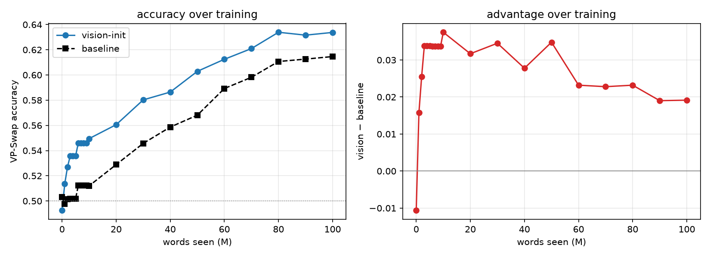
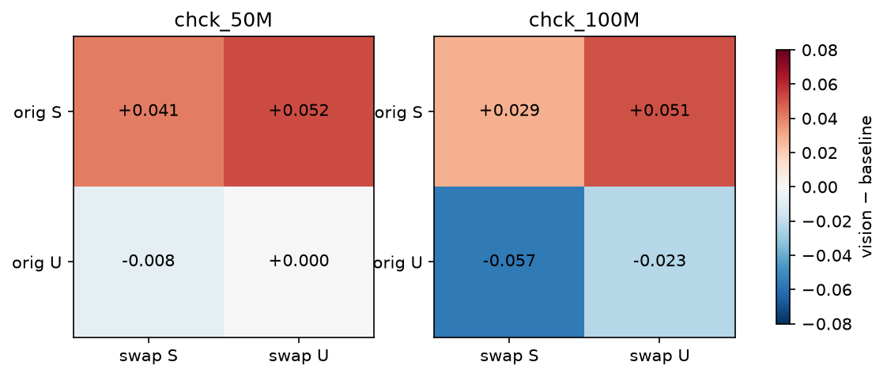

# augustinian-babylm: vision-initialized word embeddings for small LMs

Does initializing word embeddings from **visual grounding** help a small
language model? We pretrain DeBERTa-v3-base models on a BabyLM
strict-small corpus (`bb24.train`, ~10M words) and compare random-init
baselines against **vision-initialized** variants whose embeddings for
visually grounded vocabulary are seeded from image-region features —
across three BPE vocabularies (50k/75k/100k) and three vision encoders
(DINOv3, SAM, iBOT; bbox-patch pooling). Only ~24–38% of word types (by
vocabulary size) receive a visual seed; the rest keep random init.

## Key results

**Visual initialization helps exactly where visual information should
matter — and nowhere else.**

**1. Official BabyLM 2026 evaluation.** Across all 9 encoder x vocabulary
combinations, the only consistently positive zero-shot task is **COMPS**
— conceptual property knowledge of objects (+1.3 mean, positive 9/9;
GLUE also +1.1 at 9/9). Within COMPS the gain concentrates in the
property-knowledge conditions (`base` +1.4, `wugs` +3.7, both 9/9) and
vanishes under distractors. Syntax (BLiMP) is flat; supplement slightly
negative.

**2. VP-Swap: a targeted visual-property probe.** We construct a
minimal-pair benchmark from our own training corpus
([`eval/vpswap_bb24/`](eval/vpswap_bb24/)): does the model prefer "The
banana is yellow" over "The television is yellow"? — 7,416 items over
color/material/size/shape, frequency-binned, each noun tagged by whether
it received a visual seed. Comparing the best vision-init model
(75k-SAM) to its baseline:

- **Persistent advantage**: vision-init leads at every checkpoint from
  1M words on, peaking mid-training (+3.5) and retaining +1.9 at 100M
  (McNemar z = 3.75). Untrained checkpoints score 0.49–0.50 (clean probe).

- **Word-specific and causally tied to the seeding**: at matched
  corpus frequency, the advantage holds for seeded nouns and not for
  unseeded ones (DiD positive in every measurable bin). In the 2x2 by
  (original-word seeded x swap-word seeded), the never-touched placebo
  cell is exactly null mid-training (+0.000) — and late training shows
  the effect cutting both ways: a seeded *swap* word makes the wrong
  sentence more plausible (−0.057), the same knowledge seen from the
  other side.

- Effect present in 3 of 4 syntactic frames (copular reverses, noted);
  concentrated in mid/high-frequency bins — the low-frequency tail is at
  floor for both models at this corpus size.

Full tables: [`eval/official_results.md`](eval/official_results.md),
[`eval/vpswap_results.md`](eval/vpswap_results.md).

**Why the effect is invisible in aggregate scores:** our coverage
analysis ([`analysis/`](analysis/)) shows the seedable fraction of word
*types* falls 37.7% → 29.1% → 23.8% across vocabularies and skews
strongly concrete (r = 0.46 with concreteness); syntax-heavy benchmarks
never look where the effect lives.

**Limitations.** Single seed per training run; VP-Swap is LLM-generated
(generator: claude-sonnet-4-6; judge: claude-haiku-4-5) and inherits the
generator's property notions; the copular-frame reversal is unexplained;
entity-tracking scores under MLM pseudo-likelihood are artifact-prone and
excluded from interpretation (diagnosis:
[`docs/entity_tracking_artifact.md`](docs/entity_tracking_artifact.md)).

## Repository map

| path | contents |
|--|--|
| `scripts/` | training + construction: region embeddings, token tables, vision-init training, VP-Swap builder, submission-branch minting |
| `slurm/` | SLURM templates for every pipeline stage |
| `analysis/` | text-vs-image coverage study (code, outputs, README) |
| `eval/` | evaluation runbooks, scorers, analysis scripts, results, plots |
| `docs/` | methodological notes |

## Reproduction pipeline

Environment: Snellius (SLURM, A100) or any CUDA machine; HF org
`augustinian-babylm` hosts tokenizers, grounding embeddings, and all
model checkpoints (stepN + chck_*M revisions). Steps, in order:

1. **Region embeddings** from grounding datasets (Flickr30k Entities,
   RefCOCO/g/+, THINGS) per encoder:
   `scripts/extract_region_embeddings.py` / `slurm/extract_region_embeddings.slurm`
   -> HF `augustinian-babylm/region-embeddings`
2. **Token embedding tables** per (vocab, encoder):
   `scripts/build_token_embeddings.py` / `slurm/build_tables.slurm`
   -> HF `augustinian-babylm/token-embeddings` (E_init + seeded mask;
   unseeded rows are overwritten by model init at load)
3. **Training** (babylm25 Table-3 recipe, 10 epochs):
   baselines `slurm/train.slurm`; vision-init `slurm/train_visioninit.slurm`
   (`--init_embeddings/--init_encoder/--init_tag`); batch driver
   `run_75k_100k.sh` -> HF `deberta-base-{vocab}[-{encoder}]`
4. **Coverage analysis**: `analysis/` (see its README)
5. **Official evaluation + leaderboard comparison**: `eval/README.md` §A
6. **VP-Swap construction + evaluation**: `eval/README.md` §B
7. **Analysis + figures**: `eval/analyze_official.py`, `eval/analyze_vpswap.py`

## Models

12 pretrained models on HF (`augustinian-babylm/deberta-base-<vocab>` and
`...-<encoder>`), each with 37 stepN training checkpoints and 19 `chck_*M`
word-count revisions (BabyLM submission convention; `main` = final).
