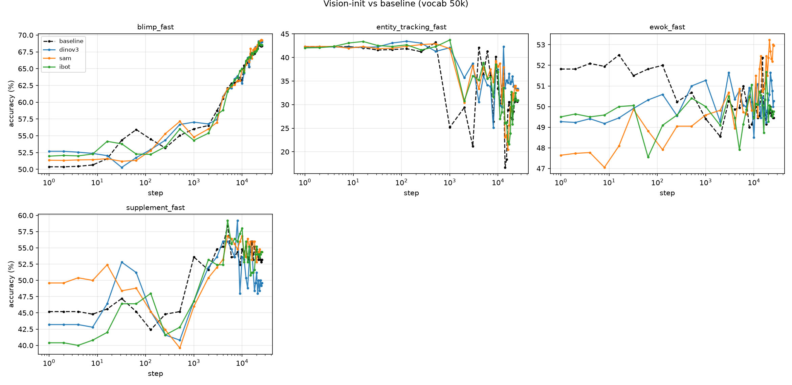

# Checkpoint evaluation: BabyLM fast zero-shot over training dynamics

Evaluates every training checkpoint of the three DeBERTa baselines
(augustinian-babylm/deberta-base-{50k,75k,100k}) on the BabyLM 2026
strict-small fast zero-shot tasks, producing a long-format CSV and dynamics
plots (accuracy vs. training step, per task, per vocab).

Tasks (fast set): blimp, blimp-supplement, ewok, entity_tracking, reading.
Backend flag is "mlm" everywhere (masked-LM pseudo-log-likelihood scoring) --
the models are masked LMs, not causal.

## One-time setup

1. Eval pipeline (forked). We use a fork of babylm-org/babylm-eval with
   compatibility patches (see "Compat patches" below). Clone it and build the
   eval venv (SEPARATE from training: pins transformers 4.51.3 / torch 2.7.0):

       git clone https://github.com/bylinina/babylm-eval.git ~/babylm-eval
       module load 2024 Python/3.12.3-GCCcore-13.3.0 CUDA/12.6.0
       EVALENV=/scratch-shared/$USER/babylm-eval/venv_eval
       python -m venv $EVALENV && source $EVALENV/bin/activate
       pip install -q --upgrade pip
       cd ~/babylm-eval/strict
       pip install -q torch==2.7.0 --index-url https://download.pytorch.org/whl/cu126
       pip install -q -r requirements.txt

2. Eval data. From ~/babylm-eval/strict, venv active, HF auth done
   (hf auth login; member of augustinian-babylm):

       python -m scripts.download_evals
       python -c "import nltk; nltk.download('punkt_tab')"
       # accept EWoK terms in a browser first:
       #   huggingface.co/datasets/ewok-core/ewok-core-1.0
       python -m evaluation_pipeline.ewok.dl_and_filter
       # unzip ewok_fast FROM THE strict/ ROOT (zip carries full internal paths):
       unzip -o -P BabyLM2025 evaluation_data/fast_eval/ewok_fast.zip
       ls evaluation_data/fast_eval/ewok_fast/

## Running the sweep (after training completes)

1. Verify training finished: sacct shows COMPLETED, and each repo has the full
   stepN branch set (~35 branches, up to ~step25000).
2. Generate the target list and submit the array (from ~/babylm-eval/strict).
   One array task = one (vocab, stepN) checkpoint; %8 caps concurrency. The
   array script loads its own modules/venv internally -- no setup needed in the
   submitting shell, no GPU node required to submit:

       mkdir -p logs
       python ~/augustinian_babylm/eval/list_eval_targets.py > eval_targets.txt
       N=$(wc -l < eval_targets.txt)
       sbatch --array=1-${N}%8 ~/augustinian_babylm/eval/eval_sweep.slurm

3. Resumable. Re-submitting the same command skips checkpoints whose results
   already exist (marker: .../reading/report.txt). Check and mop up failures:

       find results -name report.txt -path "*reading*" | wc -l   # vs wc -l eval_targets.txt
       sacct --starttime <YYYY-MM-DD> --format=JobID%25,State | grep eval | grep -v COMPLETED

## Collecting and plotting (login node, no GPU)

       pip install --user matplotlib pandas
       cd ~/babylm-eval/strict
       python ~/augustinian_babylm/eval/collect.py --results_dir results --out results_dynamics.csv
       python ~/augustinian_babylm/eval/plot_dynamics.py --csv results_dynamics.csv --outdir plots
       cp results_dynamics.csv ~/augustinian_babylm/eval/
       cp -r plots ~/augustinian_babylm/eval/

results_dynamics.csv columns: vocab, step, task, section, item, value
(section = average | field | uid | linguistics_term | score | correlation).
Raw per-checkpoint outputs stay under ~/babylm-eval/strict/results/ (not committed).

## Compat patches (in the babylm-eval fork)

Checkpoints saved by transformers 5.x record tokenizer_class "TokenizersBackend",
which the eval pipeline's transformers 4.51.3 cannot resolve. Three call sites
fall back to PreTrainedTokenizerFast (loads tokenizer.json directly):
evaluation_pipeline/__init__.py, sentence_zero_shot/dataset.py, reading/run.py.
Anyone on transformers 4.x loading these repos needs the same fallback.

## Notes / gotchas

- Excluded from the sweep: main, best (best duplicates a stepN), and the
  step0/step1 branches of the 50k repo (their safetensors were corrupt on HF;
  scientifically empty as init/one-step checkpoints, so curves start at step2).
- MLM scoring is ~10-20x heavier per sentence than causal (masks each token
  position), so per-checkpoint eval runs ~15 min; the array --time has headroom.
  If tasks TIMEOUT, raise --time in eval_sweep.slurm.
- plots/overview.png is the headline figure: accuracy vs step, per task, per vocab.

## Results: vision-init vs baseline (50k)

Four 50k models, identical training except embedding initialization: a random-init
baseline and three vision-init runs whose seeded embedding rows come from DINOv3,
SAM, and iBOT region embeddings (same 37% seeded mask in all three; only the
seeded *values* differ). Fast zero-shot accuracy vs. training step:

**Summary: effects are small and mostly wash out by convergence, with one clear
exception on entity tracking.**

- **Entity tracking** shows the strongest signal: a large *early-training*
  advantage for all three vision inits -- ~42-44% at step ~1000 vs. ~25% for the
  baseline (~17 points). The gap narrows through training and final accuracy is
  noisy/comparable (~31-33% vs. 31%), so the effect is a faster early rise rather
  than a better endpoint. Notably it is consistent across all three encoders.
- **BLiMP** is effectively a wash: final ~68-69% for all four (baseline 68.4;
  dinov3 69.0, sam 69.3, ibot 68.5), within noise. A small dinov3 early edge
  (57.0 vs. 56.0 at step ~1k) disappears by mid-training.
- **EWoK** sits near chance for all (baseline also ~50), as in the baseline study;
  SAM ends slightly higher (53.0 vs. 49.5) but on a task where the baseline is at
  chance, so this is weak.
- **Supplement** shows an early *disadvantage* for vision-init (~46-47% vs. 53.6%
  at step ~1k) that mostly recovers; final is mixed (sam/ibot 54.4 vs. baseline
  53.2; dinov3 lower at 49.6).

**No encoder dominates.** Differences among DINOv3/SAM/iBOT are within noise on most
tasks; SAM is marginally best on a few final language-task numbers. Since all three
share the identical seeded mask, any differences come purely from the quality of
each encoder's visual features, not from coverage.

**Interpretation.** The clearest effect appears on entity tracking -- the most
semantics/state-oriented of the tasks -- and as a head-start that training erodes,
while purely syntactic BLiMP is unaffected. This is consistent with the Stage 1.5
coverage finding that vision grounds concrete, content-bearing vocabulary rather
than syntactic or function-word structure: vision-init helps where grounded
semantics matter, and washes out where the signal is syntactic or where the model
quickly learns the relevant distribution from text alone.

Per-task figures: `plots/visioninit_{blimp,supplement,ewok,entity_tracking}_fast.png`.
Underlying data: `results_dynamics.csv` (columns vocab, init, step, task, section,
item, value). Caveat: single seed per run, so small final-accuracy differences
(<~1-2 pts) should not be over-interpreted; the entity-tracking early gap is the
robust effect.
