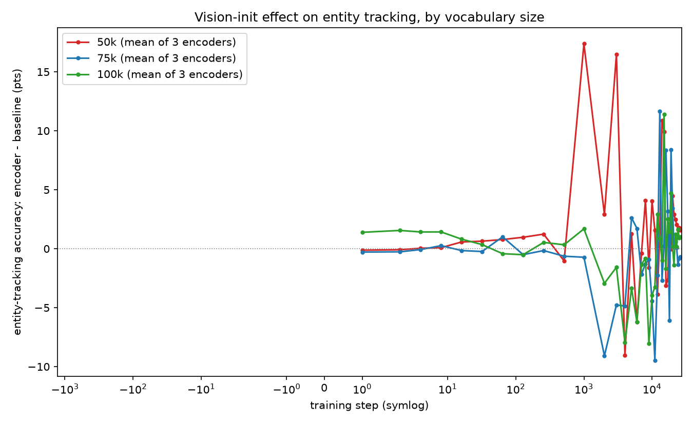
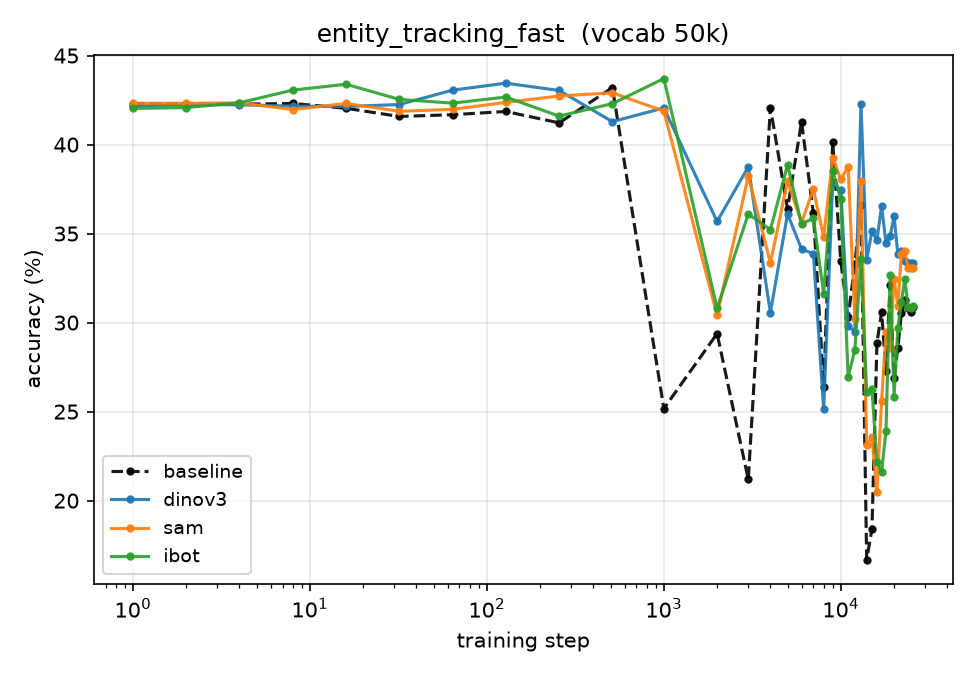
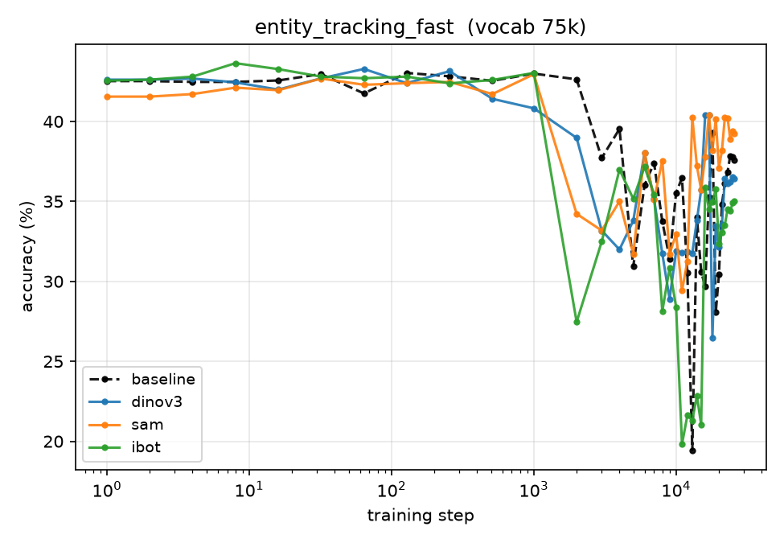
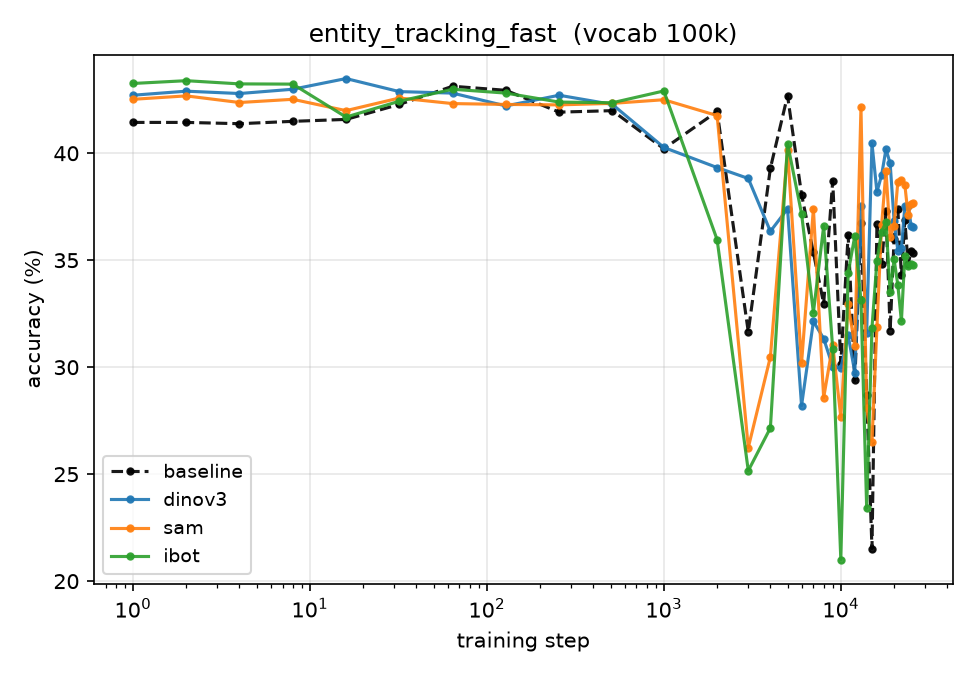
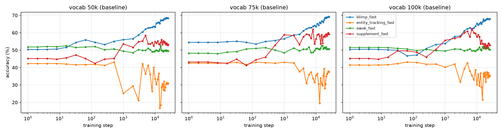

# Evaluation: checkpoint dynamics + full battery

Evaluates all twelve model configurations — three vocabulary sizes (50k / 75k /
100k) × four initializations (random-init **baseline** + vision-init from
**DINOv3 / SAM / iBOT**) — on the BabyLM 2026 strict-small suite. The fast
zero-shot sweep runs over the *entire* Pythia-style checkpoint trajectory of every
config; the full zero-shot battery and GLUE/SuperGLUE fine-tuning run over a
selected subset (see [Full battery + GLUE](#full-battery--glue-in-progress)).

All scoring uses the **`mlm` backend** (masked-LM pseudo-log-likelihood) — these
are masked LMs, not causal.

- Fast-eval results CSV: `results_dynamics.csv` (`vocab, init, step, task, section, item, value`)
- Figures: `plots/` (cross-vocab) and `plots_{50k,75k,100k}/` (per-vocab trajectories)
- Eval pipeline: the fork [`bylinina/babylm-eval`](https://github.com/bylinina/babylm-eval)

---

## Procedure

### One-time setup

The eval pipeline is a **fork** of `babylm-org/babylm-eval` with compatibility
patches (see [Compat patches](#compat-patches)). The eval venv is **separate from
training** — it pins transformers 4.x:

```bash
git clone https://github.com/bylinina/babylm-eval.git ~/babylm-eval
module load 2024 Python/3.12.3-GCCcore-13.3.0 CUDA/12.6.0
EVALENV=/scratch-shared/$USER/babylm-eval/venv_eval
python -m venv $EVALENV && source $EVALENV/bin/activate
pip install -q --upgrade pip
cd ~/babylm-eval/strict
pip install -q torch==2.7.0 --index-url https://download.pytorch.org/whl/cu126
pip install -q -r requirements.txt
```

Eval data (from `~/babylm-eval/strict`, venv active, `hf auth login` done):

```bash
python -m scripts.download_evals
python -c "import nltk; nltk.download('punkt_tab')"
# accept EWoK terms at huggingface.co/datasets/ewok-core/ewok-core-1.0 first:
python -m evaluation_pipeline.ewok.dl_and_filter
unzip -o -P BabyLM2025 evaluation_data/fast_eval/ewok_fast.zip   # run from strict/ root
```

### Fast zero-shot sweep (all checkpoints)

One array task = one (config, stepN) checkpoint. `list_eval_targets.py` enumerates
all baseline + vision-init repos × stepN branches from HF. The array loads its own
modules/venv internally; submit from a login node (no GPU needed to submit):

```bash
cd ~/babylm-eval/strict && mkdir -p logs
python ~/augustinian_babylm/eval/list_eval_targets.py > eval_targets.txt
N=$(wc -l < eval_targets.txt)
sbatch --array=1-${N}%8 --export=ALL,HF_TOKEN ~/augustinian_babylm/eval/eval_sweep.slurm
```

**Resumable** — re-submitting skips checkpoints whose results exist (marker:
`.../reading/report.txt`). Mop up failures:

```bash
find results -name report.txt -path "*reading*" | wc -l   # vs wc -l eval_targets.txt
sacct --starttime <date> --format=JobID%25,State | grep eval | grep -v COMPLETED
```

> **Cache note:** `%8` concurrency can corrupt a shared HF blob when multiple tasks
> download the same repo at once (`JSONDecodeError` / `SafetensorError` on
> `config.json`). If a contiguous block of one repo's tasks fails, clear that repo's
> cache (`rm -rf /scratch-shared/$USER/hf_cache/hub/models--...`) and resubmit with a
> lower throttle (`%2`).

### Collect + plot (login node, no GPU)

```bash
source /scratch-shared/$USER/babylm-eval/venv_eval/bin/activate
cd ~/babylm-eval/strict
python ~/augustinian_babylm/eval/collect.py --results_dir results --out results_dynamics.csv
python ~/augustinian_babylm/eval/plot_dynamics.py --csv results_dynamics.csv --outdir plots
for V in 50k 75k 100k; do
  python ~/augustinian_babylm/eval/plot_dynamics.py --csv results_dynamics.csv --outdir plots_$V --init_vocab $V
done
python ~/augustinian_babylm/eval/plot_entity_overlay.py --csv results_dynamics.csv --out plots/entity_overlay.png
cp results_dynamics.csv ~/augustinian_babylm/eval/ && cp -r plots* ~/augustinian_babylm/eval/
```

`collect.py` parses results regardless of tree depth (anchors on the `zero_shot`
path component), so it works whether `--results_dir` points at `.` or `results/`.
Raw per-checkpoint outputs stay under `~/babylm-eval/strict/results/` (not committed).

---

## Compat patches

These live in the [`bylinina/babylm-eval`](https://github.com/bylinina/babylm-eval)
fork and are required to evaluate our models. Anyone on transformers 4.x loading
these transformers-5.x-saved checkpoints needs them.

**Tokenizer class (zero-shot).** Checkpoints record `tokenizer_class`
"TokenizersBackend", which transformers 4.x cannot resolve. Three zero-shot call
sites fall back to `PreTrainedTokenizerFast` (loads `tokenizer.json` directly):
`evaluation_pipeline/__init__.py`, `sentence_zero_shot/dataset.py`,
`reading/run.py`.

**Tokenizer + processor (fine-tuning).** The finetune trainer loaded the tokenizer
via `AutoProcessor`, which fails on text-only models (it expects a multimodal
processor). `finetune/trainer.py` now tries `AutoProcessor` →
`AutoTokenizer` → `PreTrainedTokenizerFast` in turn, and threads `revision_name`
through so a specific branch's tokenizer is loaded.

**Revision arg (full zero-shot).** `scripts/eval_zero_shot.sh` gained a `REVISION`
argument (`--revision_name` on every task call) — without it the script could only
evaluate `main`, not a specific stepN/best branch.

---

## Results (fast zero-shot, all checkpoints)

Twelve configs × the full checkpoint trajectory. Deltas below are **vision-init
minus baseline** (accuracy points), averaged within each training phase
(early ≤ step 1000, mid 1k–8k, late > 8k); "peak" is the single largest
encoder-minus-baseline delta and the step it occurs at. Baseline finals are the
random-init endpoint for that vocab.

The reading-task correlations are reported separately in `results_dynamics.csv`
(`section=correlation`) and omitted from these accuracy tables.

### BLiMP — wash at every vocabulary

| vocab | encoder | early | mid | late | peak (step) | base final | final spread |
|-------|---------|------:|----:|-----:|------------:|-----------:|-------------:|
| 50k  | dinov3 | +0.3 | −0.0 | +0.2 | +2.3 (s0)     | 68.4 | 0.7 |
|      | sam    | −0.2 | −0.4 | +0.4 | +2.1 (s256)   |      |     |
|      | ibot   | +0.2 | −0.5 | +0.2 | +2.6 (s16)    |      |     |
| 75k  | dinov3 | −1.2 | −0.4 | −0.1 | +1.4 (s512)   | 69.1 | 0.4 |
|      | sam    | −2.4 | −0.2 | −0.1 | +1.8 (s14000) |      |     |
|      | ibot   | −3.5 | −1.0 | −0.4 | +1.4 (s10000) |      |     |
| 100k | dinov3 | +1.7 | −0.1 | +0.3 | +3.3 (s512)   | 67.9 | 1.1 |
|      | sam    | +1.6 | +0.0 | +1.1 | +4.8 (s128)   |      |     |
|      | ibot   | +1.2 | −0.1 | +0.9 | +5.5 (s64)    |      |     |

Phase-mean deltas sit within ±1–3.5 pts and **change sign across vocabularies**
(75k uniformly slightly negative; 100k slightly positive). The only sizeable peaks
occur at step 0–512 — i.e. at or near initialization, before training acts. Final
cross-encoder spread (0.4–1.1 pts) is comparable to any gain. **Vision
initialization does not affect syntactic competence at any vocabulary size.**

### Entity tracking — a coherent 50k spike; incoherent noise above

| vocab | encoder | early | mid | late | peak (step) | base final | final spread |
|-------|---------|------:|----:|-----:|------------:|-----------:|-------------:|
| 50k  | dinov3 | +1.8 | +0.2 | +4.8 | **+17.6 (s3000)**  | 30.9 | 2.5 |
|      | sam    | +1.7 | +2.1 | +1.6 | **+17.0 (s3000)**  |      |     |
|      | ibot   | +2.0 | +1.6 | −0.5 | **+18.5 (s1000)**  |      |     |
| 75k  | dinov3 | −0.2 | −2.2 | +0.7 | +12.3 (s13000) | 37.6 | 4.2 |
|      | sam    | −0.5 | −1.9 | +3.7 | +20.8 (s13000) |      |     |
|      | ibot   | +0.2 | −3.6 | −3.2 | +7.7 (s19000)  |      |     |
| 100k | dinov3 | +0.7 | −2.6 | +1.8 | +18.9 (s15000) | 35.3 | 2.9 |
|      | sam    | +0.6 | −3.9 | +0.9 | +5.4 (s13000)  |      |     |
|      | ibot   | +1.0 | −3.8 | −1.1 | +10.3 (s15000) |      |     |

This is the one place vision-init moves the curve, and reading the table carefully
matters. **At 50k the spike is coherent:** all three encoders peak at +17 to +18
pts at the *same* early step (1000–3000). That cross-encoder agreement at a shared
step is the signature of a real effect rather than seed noise.

**At 75k and 100k there are still large peaks (+12 to +21), but they are
incoherent** — each encoder peaks at a *different, late* step (s13000–s19000) with
no agreement, surrounded by *negative* mid-training deltas (−2 to −4). That is the
signature of variance, not a shared transient: pick any single late checkpoint and
one encoder may look great while the others look bad. So "the spike vanishes above
50k" means the *coherent* transient is 50k-specific; the higher-vocab models still
swing, but incoherently.

The single-panel overlay makes the coherence difference visible — the 50k line
spikes sharply and early; 75k/100k stay flat-with-jitter:



Per-vocab entity-tracking trajectories (baseline vs. three encoders):





Final-checkpoint gains are small and positive at all scales (best-encoder
+2.5 / +1.7 / +2.3) but sit within the cross-encoder spread (2.5–4.2 pts), so they
are not separable from seed variance.

### EWoK and supplement — small and inconsistent

| task | vocab | early (d/s/i) | late (d/s/i) | base final | final spread |
|------|-------|---------------|--------------|-----------:|-------------:|
| ewok | 50k  | −1.5 / −3.0 / −1.9 | +0.4 / +1.9 / +0.3 | 49.5 | 3.2 |
|      | 75k  | +1.2 / +1.3 / +0.5 | −0.7 / −0.0 / −0.0 | 50.6 | 1.4 |
|      | 100k | −0.6 / −0.4 / −0.8 | +0.5 / −0.2 / −0.4 | 50.3 | 1.2 |
| supp | 50k  | −0.7 / +1.6 / −2.6 | −3.3 / +0.8 / −0.1 | 53.2 | 4.8 |
|      | 75k  | −2.8 / +2.9 / +1.0 | −0.0 / −2.7 / −0.9 | 59.2 | 4.8 |
|      | 100k | +0.8 / +1.7 / −1.6 | +0.8 / −0.4 / +2.6 | 52.8 | 2.0 |

(d/s/i = dinov3 / sam / iBOT.) No consistent direction within or across
vocabularies; per-encoder signs disagree (e.g. supplement early at 75k is −2.8 for
dinov3 but +2.9 for sam). EWoK baselines hover near chance (~50). No clean
vision-init signal on either task.

### No encoder dominates

Across every task × vocabulary the leading encoder rotates, and the final
cross-encoder spread is comparable to or larger than any encoder's gain over
baseline. Since all three encoders at a given vocab share the *identical* seeded
mask (only the seeded *values* differ), any encoder differences reflect feature
quality, not coverage.

### Cross-vocab synthesis

The picture across all twelve configs: **vision initialization affects the
state/semantics task (entity tracking) and leaves syntax (BLiMP) untouched, and
even the entity-tracking effect is coherent only at 50k.** This tracks the
coverage analysis ([`../analysis/README.md`](../analysis/README.md)): the seedable
fraction — share of corpus word *types* with a grounded embedding — falls from
37.7% (50k) to 29.1% (75k) to 23.8% (100k), while token coverage stays ~87%. The
coherent transient appears at the highest seedable fraction and is gone by the
lowest; the mid-training *dips* at higher vocab (entity mid-deltas of −2 to −4)
suggest the partially-seeded table is, if anything, a transient drag once most of
it is being overwritten by text gradients.

> **Single-seed caveat.** All runs are single-seed. The 50k entity-tracking spike
> is trustworthy because it is coherent across three encoders at a shared step;
> everything else — the small final gains, the higher-vocab peaks, the sign of the
> BLiMP/EWoK/supplement deltas — is within seed variance and should not be
> over-interpreted. Confirming any of it requires multiple seeds.

Headline figure (accuracy vs. step, baseline only, all tasks, one vocab):



---

## Full battery + GLUE (in progress)

Beyond the fast sweep, the **full zero-shot battery** (BLiMP, BLiMP-Supplement,
EWoK, Entity Tracking, COMPS, Reading on the unsubsampled data) and
**GLUE/SuperGLUE fine-tuning** (boolq, multirc, rte, wsc, mrpc, qqp, mnli — the
official BabyLM subset) run over **24 selected checkpoints**: for each of the 12
configs, the `best`-by-loss branch plus the step maximizing a 4-task fast-eval
composite. Harness: `slurm/full_zeroshot.slurm` (24 targets) and
`slurm/glue_finetune.slurm` (24 × 7 = 168 fine-tune tasks); selection in
`eval/full_eval_targets.txt`, GLUE recipes in `eval/glue_params.tsv`.

These runs are currently in progress. Results, the cross-vocab full-battery
profile, and the comparison against the official GPT-BERT baseline (published
masked-focus 10M numbers) will be added here when complete.
